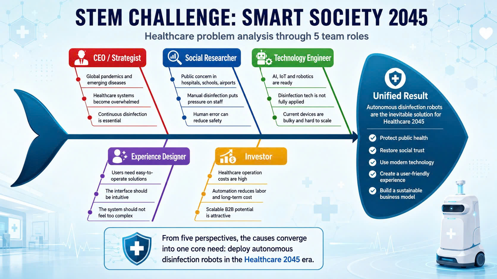
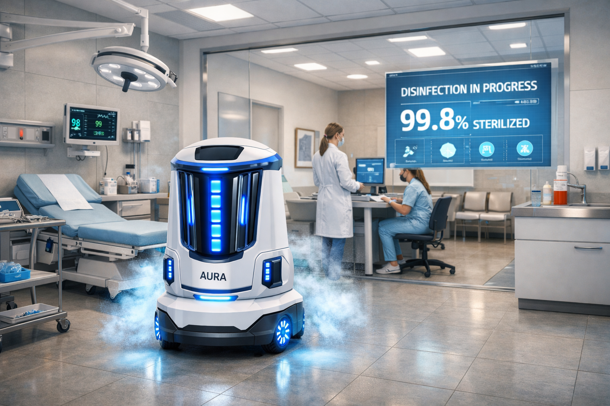

# 🌍 STEM CHALLENGE: TÔI VẼ TƯƠNG LAI XÃ HỘI THÔNG MINH 2045

Chào mừng các đội ngũ sáng lập trẻ đến với không gian lưu trữ và quản lý dự án Capstone cuối khóa! Đây là nơi nhóm của bạn sẽ số hóa ý tưởng, xây dựng giải pháp công nghệ và chuẩn bị "hồ sơ gọi vốn" cho ngày hội **Demo Day (Future Tech Showcase)**.

# [PHẦN II] HỒ SƠ STARTUP: KÝ SỰ KIẾN TẠO XÃ HỘI THÔNG MINH 2045

## 🚀 1. TÊN STARTUP: FutureCare Robotics
* **Khẩu hiệu (Slogan):** "Khử khuẩn thông minh – Tương lai an toàn."
* **Lớp:** STEM.01.26

### 👥 Đội ngũ sáng lập (5 Vai trò - 5 Sức mạnh)
1. **Trần Chí Phát** - **CEO (Nhà chiến lược):** Điều phối nhóm, nghiên cứu thị trường và đưa ra quyết định cuối cùng.
2. **Yamamura Shunsuke** - **Nhà nghiên cứu xã hội:** Thu thập số liệu, tìm hiểu nỗi đau (Pain points) và nhu cầu của người dân.
3. **Bùi Nhật Huy** - **Kỹ sư công nghệ:** Đề xuất và chịu trách nhiệm về kiến trúc công nghệ (AI, Robot, Drone, IoT...).
4. **Bùi Nhật Huy** - **Nhà thiết kế trải nghiệm:** Phụ trách vẽ bản vẽ phối cảnh, thiết kế giao diện ứng dụng và slide.
5. **Lâm Tuấn Anh** - **Nhà đầu tư:** Đánh giá tính khả thi, chi phí - lợi ích và xây dựng mô hình kinh doanh.

---

## ⚠️ 2. ĐẶT VẤN ĐỀ & TƯ DUY HỆ THỐNG (SYSTEM THINKING)
* **Vấn đề nhức nhối nhóm chọn giải quyết:** Làm thế nào để khử khuẩn hiệu quả, an toàn và minh bạch trong môi trường y tế và công cộng vượt ra ngoài giới hạn của hệ thống UV cố định?
* **Bản phân tích nguyên nhân - hậu quả:**
  * *Nguyên nhân:*
    1. Đại dịch toàn cầu (COVID-19, cúm, bệnh truyền nhiễm mới) cho thấy hệ thống y tế dễ bị quá tải, trong khi nhu cầu khử khuẩn và kiểm soát dịch bệnh là liên tục.
    2. Người dân lo lắng về môi trường sống, bệnh viện đông đúc, nguy cơ lây nhiễm chéo. Nhân viên y tế chịu áp lực lớn khi phải khử khuẩn thủ công.
    3. Công nghệ AI, IoT, Robot đã sẵn sàng nhưng chưa được ứng dụng triệt để trong khử khuẩn. Các thiết bị hiện tại thường cồng kềnh, thiếu tự động hóa và khó tích hợp.
    4. Người dùng (bệnh viện, trường học, sân bay) cần một giải pháp dễ vận hành, trực quan, không phức tạp.
    5. Healthcare là ngành có chi phí cao, nhưng giải pháp khử khuẩn tự động giúp tiết kiệm nhân lực, giảm chi phí dài hạn và mở ra mô hình kinh doanh B2B (bán cho bệnh viện, trường học, sân bay).

  * *Hậu quả trực tiếp:*
   Hệ thống y tế và không gian công cộng hiện nay đang thiếu một giải pháp khử khuẩn toàn diện, linh hoạt và minh bạch; nếu không có công nghệ tự động như robot khử khuẩn, xã hội sẽ tiếp tục đối mặt với nguy cơ lây nhiễm cao, chi phí nhân lực lớn, niềm tin người dân suy giảm và bỏ lỡ cơ hội hình thành mô hình kinh doanh bền vững trong ngành Healthcare.

*Sơ đồ tư duy hệ thống chi tiết của nhóm (Đính kèm file ảnh từ thư mục research_system):*

---

## 💡 3. THIẾT KẾ STARTUP & MÔ HÌNH KINH DOANH
* **Khách hàng mục tiêu:** Bệnh viện, phòng khám, trường học, chung cư, sân bay, và nhà ga.
* **Giải pháp của Startup:** Robot tự hành khử khuẩn thông minh, kết hợp UV-C + phun sương khử khuẩn + lọc không khí, được điều hướng bằng AI và cảm biến IoT.
  * Robot di chuyển tự động đến khu vực cần khử khuẩn.
  * Hệ thống dashboard hiển thị dữ liệu khử khuẩn theo thời gian thực.
  * Giúp giảm nhân lực, tăng hiệu quả, và minh bạch hóa quy trình vệ sinh.

* **Tổ hợp Công nghệ cốt lõi ứng dụng (Chọn các công nghệ phù hợp):**
  * [ ] **AI Vision (Thị giác máy tính):** Nhận diện khu vực đông người, phát hiện bề mặt cần khử khuẩn, tránh chướng ngại vật.
  * [ ] **Robot/UAV & Actuator (Cơ cấu chấp hành):** Nền tảng robot tự hành với hệ thống phun khử khuẩn và đèn UV-C tích hợp.
  * [ ] **IoT & Cloud (Internet vạn vật):** Thu thập dữ liệu cảm biến (chất lượng không khí, mức độ khử khuẩn) và gửi lên cloud để giám sát minh bạch.
  * [ ] **Green Energy (Năng lượng tái tạo):** Sử dụng pin sạc kết hợp trạm sạc năng lượng mặt trời để giảm phát thải carbon.
  * [ ] **Big Data & Analytics:** Phân tích dữ liệu vận hành để tối ưu lịch trình khử khuẩn, dự báo nguy cơ lây nhiễm.

---

## 🎨 4. BẢN VẼ PHỐI CẢNH XÃ HỘI THÔNG MINH 2045

*Hình ảnh bản vẽ phối cảnh của nhóm (Đính kèm file ảnh từ thư mục design_visuals):*

Bức phối cảnh phòng khám tương lai ở trên thể hiện rõ cách robot khử khuẩn tự động hoạt động trong môi trường thực tế.
Trong không gian sạch sẽ, hiện đại, robot AURA di chuyển nhẹ nhàng giữa các giường khám, phát tia UV-C và phun sương khử khuẩn, trong khi bác sĩ và y tá theo dõi dữ liệu khử khuẩn trên màn hình hiển thị “99.8% STERILIZED”. Mọi hoạt động đều được giám sát qua bảng điều khiển thông minh, giúp đảm bảo an toàn tuyệt đối cho bệnh nhân và nhân viên y tế.
Đây chính là hình ảnh thu nhỏ của Smart Healthcare 2045 — nơi công nghệ và con người phối hợp hài hòa để tạo ra môi trường y tế chủ động, minh bạch và đáng tin cậy.
---

## 🧠 5. TẠO TRI THỨC MỚI (REFLECTION)
Sau 3 tuần đồng hành và kiến tạo dự án, đội ngũ sáng lập của chúng tôi đã đúc kết được:
* **Chúng tôi phát hiện rằng:** Khử khuẩn không chỉ là một hành động vệ sinh, mà là một yếu tố tâm lý – xã hội ảnh hưởng trực tiếp đến niềm tin và cảm giác an toàn của con người. Khi người dân nhìn thấy quy trình khử khuẩn minh bạch, họ cảm thấy được bảo vệ và tin tưởng hơn vào hệ thống y tế. Đây là “sự thật ngầm hiểu” mà trước đây nhóm chỉ nhìn dưới góc kỹ thuật, chưa thấy hết giá trị cảm xúc và niềm tin xã hội mà công nghệ có thể mang lại.
* **Chúng tôi học được rằng:** Công nghệ chỉ thực sự có ý nghĩa khi được con người chấp nhận và tin tưởng. Sự kết hợp giữa kỹ sư, nhà thiết kế, và chuyên gia y tế giúp chúng tôi hiểu rằng robot không chỉ cần hoạt động tốt, mà còn phải “giao tiếp” được với con người – qua giao diện, dữ liệu minh bạch, và trải nghiệm thân thiện.
Đây cũng là bài học lớn về làm việc nhóm đa lĩnh vực, nơi mỗi người nhìn vấn đề từ một góc khác nhưng cùng hướng đến một mục tiêu chung: sức khỏe cộng đồng.
* **Ý tưởng mới/Điểm cải tiến độc đáo nhất của dự án là:** Robot khử khuẩn của Future Robotics không chỉ là thiết bị tự hành, mà là nền tảng dữ liệu khử khuẩn thông minh – nơi mọi hoạt động đều được ghi nhận, phân tích và hiển thị minh bạch.
Điểm khác biệt nằm ở việc robot biến quá trình khử khuẩn thành dữ liệu niềm tin, giúp bệnh viện, trường học, và khu dân cư chứng minh được mức độ an toàn theo thời gian thực.
Đây là bước chuyển từ “robot làm việc” sang “robot tạo niềm tin”.
---

## 📊 6. BẢNG TỰ ĐÁNH GIÁ Ý TƯỞNG (Max: 50 điểm)
*Nhóm tự thảo luận và chấm điểm dự án của mình theo các tiêu chí chuẩn của Demo Day:*

| Tiêu chí | Điểm tối đa | Nhóm tự chấm | Ghi chú lý do đạt số điểm này |
| :--- | :---: | :---: | :--- |
| **1. Giải quyết vấn đề lớn** | 10 | `8/10` | Nhu cầu khử khuẩn trong bệnh viện, trường học, nhà máy là có thật. Tuy nhiên, mức độ nhận thức và ưu tiên đầu tư cho khử khuẩn tự động ở Việt Nam chưa cao, nên tác động chưa thể đạt tối đa. |
| **2. Tính sáng tạo** | 10 | `7/10` | Ý tưởng biến khử khuẩn thành dữ liệu minh bạch là mới mẻ. Nhưng thị trường vẫn còn hạn chế về khả năng tiếp nhận công nghệ này, và thiết kế cần thêm cải tiến để phù hợp với điều kiện thực tế. |
| **3. Tính khả thi** | 10 | `6/10` | Công nghệ AI, IoT, Robot đã có sẵn, nhưng chi phí đầu tư ban đầu cao. Hạ tầng và nguồn lực ở nhiều bệnh viện, trường học, nhà máy Việt Nam còn hạn chế, nên việc triển khai rộng rãi sẽ gặp khó khăn. |
| **4. Tác động xã hội** | 10 | `7/10` | Giúp giảm lo lắng về môi trường sống, tạo niềm tin khi có minh bạch dữ liệu. Tuy nhiên, mức độ chấp nhận của cộng đồng còn phụ thuộc vào truyền thông và thói quen sử dụng công nghệ mới. |
| **5. Khả năng kinh doanh** | 10 | `6/10` | Mô hình B2B có tiềm năng, nhưng cần chiến lược giá phù hợp với khả năng chi trả của khách hàng Việt Nam. Dịch vụ hậu mãi và bảo trì sẽ là yếu tố quyết định để thuyết phục khách hàng. |
| **TỔNG ĐIỂM** | **50** | `34/50` | Sản phẩm có tiềm năng, nhưng để thành công ở Việt Nam cần tối ưu chi phí, thiết kế gọn nhẹ, và chiến lược tiếp cận thị trường phù hợp. |

---
🌐 *Hồ sơ dự án được chuẩn bị bởi **Luck Over Skill** nhằm hướng tới ngày hội **Future Tech Showcase - Demo Day**.*
